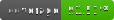

# Neutro



A high-performance, Keras-identical deep learning library implemented from scratch using **NumPy** and **SciPy**.

## Core Algorithms & Implementations

| Category | Component | Algorithm / Technique | Scientific Reference |
| :--- | :--- | :--- | :--- |
| **Convolutional** | `Conv2D`, `Conv1D` | `im2col` Vectorization | [CS231n](https://cs231n.github.io/convolutional-networks/#conv) |
| **Attention** | `MultiHeadAttention` | Scaled Dot-Product | [Vaswani et al. (2017)](https://arxiv.org/abs/1706.03762) |
| **Attention** | `MultiQueryAttention` | Shared KV heads | [Shazeer (2019)](https://arxiv.org/abs/1911.02150) |
| **Attention** | `GroupedQueryAttention` | Grouped KV heads | [Ainslie et al. (2023)](https://arxiv.org/abs/2305.13245) |
| **Attention** | `FlashAttention` | Tiling & Online Softmax | [Dao et al. (2022)](https://arxiv.org/abs/2205.14135) |
| **Recurrent** | `LSTM` | Gated Memory Cells | [Hochreiter (1997)](https://www.bioinf.jku.at/publications/older/2604.pdf) |
| **Normalization** | `BatchNormalization` | Running Stats (Spatial) | [Ioffe & Szegedy (2015)](https://arxiv.org/abs/1502.03167) |
| **Normalization** | `LayerNormalization` | Per-sample Stats | [Ba et al. (2016)](https://arxiv.org/abs/1607.06450) |
| **Optimizers** | `AdamW` | Decoupled Weight Decay | [Loshchilov (2017)](https://arxiv.org/abs/1711.05101) |
| **Optimizers** | `Adam` | Adaptive Moments | [Kingma (2014)](https://arxiv.org/abs/1412.6980) |
| **Models** | `Sequential`, `Model` | Backpropagation / Keras API | [Keras (Chollet)](https://keras.io) |

## Documentation Guide

Detailed technical explanations, mathematical derivations, and citations for every component:

- [**Activations**](./docs/activations/) - Softmax gradients, ReLU, Sigmoid, Tanh.
- [**Attention Mechanisms**](./docs/layers/attention/) - MHA, MQA, GQA, FlashAttention.
- [**Convolutional Layers**](./docs/layers/convolutional/) - Vectorization via `im2col`.
- [**Normalization**](./docs/layers/normalization/) - BatchNorm vs LayerNorm.
- [**Recurrent Layers**](./docs/layers/recurrent/) - LSTM and SimpleRNN.
- [**Optimizers**](./docs/optimizers/) - Adam, AdamW, and SGD with Momentum.
- [**Data & Models**](./docs/models/) - DataLoader, Sequential, and Model serialization.

## Features
- **Identical API**: Full support for `.compile()`, `.fit()`, `.evaluate()`, and `.predict()`.
- **High Performance**: Vectorized operations using `im2col` for Convolutions and broadcasting for Attention.
- **Transformer Ready**: Built-in `TransformerBlock`, `MHA`, and `LayerNormalization`.
- **Extensive Coverage**: >95% unit test coverage for every internal class.

## Installation
```bash
pip install -e .
```

## Example Usage
```python
from neutro.models import Sequential
from neutro.layers import Conv2D, MaxPooling2D, Flatten, Dense

model = Sequential([
    Conv2D(32, kernel_size=3, padding='same', activation='relu', input_shape=(28, 28, 1)),
    MaxPooling2D(pool_size=2),
    Flatten(),
    Dense(10, activation='softmax')
])

model.compile(optimizer='adam', loss='categorical_crossentropy', metrics=['accuracy'])
model.fit(x_train, y_train, epochs=5, batch_size=32)
```
